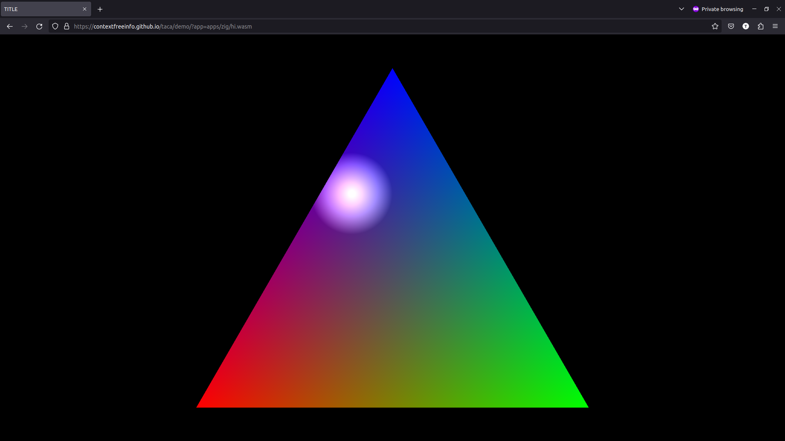

# Taca

A runtime for multimedia wasm apps that runs native and in browsers.

## Live Demos

- [Mouse pointer spotlight on RGB triangle](https://contextfreeinfo.github.io/taca/demo/?app=apps/zig/hi.wasm)
  ([Zig source](examples/zig/hi/src/main.zig))

## Demo Screenshot

^^^ SEE ACTUAL DEMO LINK JUST ABOVE. ^^^

Screenshot, which is close to half the size of the entire runtime and demo app
combined, when everything is gzipped:



## Dev Notes

Build optimized:

```sh
uglifyjs static/gl.js static/taca.js -o docs/demo/taca.js
cargo build --target wasm32-unknown-unknown --profile release-lto
wasm-opt -Os target/wasm32-unknown-unknown/release-lto/taca.wasm \
    -o docs/demo/taca.wasm
```

Run native:

```sh
cargo run --release -- run examples/zig/hi/zig-out/bin/hi.wasm
```

Run web:

```sh
# First time: npm install -g http-server
https-server .
```

Open: http://127.0.0.1:8080/static/?app=../examples/zig/hi/zig-out/bin/hi.wasm

## Sources

These files are copied and maybe modified from miniquad:

- static/gl.js
- static/index.html

## Exploration

Size on WGSL:

```
-rw-r--r--  1 tom tom  957899 Jun  9 06:09 taca.opt.wasm
-rwxr-xr-x  2 tom tom 1062610 Jun  9 10:13 taca.wasm
...
-rw-r--r-- 1 tom tom  424 Jun  7 14:12 shader.wgsl
-rw-r--r-- 1 tom tom  226 Jun  7 14:12 shader.wgsl.gz
```

Size on SPIR-V:

```
-rw-r--r--  1 tom tom 766449 Jun  9 10:58 taca.opt.wasm
-rwxr-xr-x  2 tom tom 852427 Jun  9 10:58 taca.wasm
...
-rw-r--r-- 1 tom tom 1056 Jun  9 10:55 shader.spv
-rw-r--r-- 1 tom tom  438 Jun  9 10:55 shader.spv.gz
```
