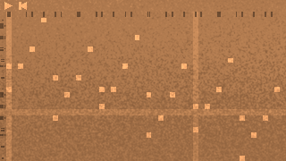
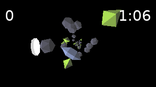
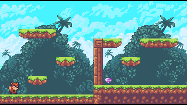

# Taca

A runtime for multimedia wasm apps that runs native and in browsers.

## Live Demos

WebAssembly allows a variety of source languages to be used.

|C++|C3|
|:-:|:-:|
|[<br>Music Box](https://contextfreeinfo.github.io/taca/demo/?app=apps/cpp/music.taca) ([source](examples/cpp/music/src/))|[<br>Asteroid Tunnel](https://contextfreeinfo.github.io/taca/demo/?app=apps/c3/fly.taca) ([source](examples/c3/fly/src/))|

|Nelua|Odin + Nim|
|:-:|:-:|
|[<br>Platformer](https://contextfreeinfo.github.io/taca/demo/?app=apps/nelua/walk.taca) ([source](examples/nelua/walk/src/))|[<br>Guessing Game](https://contextfreeinfo.github.io/taca/demo/?app=apps/odin/guess.taca) ([source](examples/odin/guess/src/))|

|Zig|
|:-:|
|[<br>Shapes](https://contextfreeinfo.github.io/taca/demo/?app=apps/zig/hi2.taca) ([source](examples/zig/hi/src/))|

Any of these languages or various others could have been used for any of these
demos. And note that all links above go to the same page. The only thing that
changes is the Taca app binary being loaded.

## Goals

- Provide core capabilities rather than high level abstractions
- Still make the core API both small and easy to use
- Choose features that enable lightweight implementation in browser
- Native player runs unmodified apps in lighter weight runtime than browser
- Eventually compete with browsers for app distribution
- High security, including no network access, by default

## Dev Notes

### Containers

Containers might make life easier:

```bash
# Get the image
podman pull ghcr.io/contextfreeinfo/taca-dev:latest
# Use the image in this dir
podman run --rm -it -v $PWD:/workspace taca-dev:latest bash
# Run the dev server from the web dir
podman run --rm -it -p 5173:5173 -p 24678:24678 -v $PWD:/workspace taca-dev:latest bash
npm run dev -- --host 0.0.0.0
# Run the preview server from the web dir
podman run --rm -it -p 4173:4173 -v $PWD:/workspace taca-dev:latest bash
npm run preview -- --host 0.0.0.0
```

Or use Docker if you need to.

Even if you don't use a container, the Containerfile gives info on dependencies
for building things.

### Demo apps

See [the workflow file](.github/workflows/deploy.yml) for examples of how to
build the demo apps, but they approximately build as follows:

```sh
cd examples/zig/hi
./build.sh
```

That puts the built taca app under the top-level web dir for easy access there.

Each demo has different dependencies. See [the containerfile](Containerfile) for
information on how to acquire dependencies.

### Native runtime

For native, go back to the top dir and either build faster:

```sh
cargo run --bin taca --profile release-quick -- run web/public/apps/zig/hi.taca
```

Or build more optimized:

```sh
cargo run --bin taca --release -- run web/public/apps/zig/hi.taca
```


### Web runtime

Look at package.json under web for web versions:

```sh
cd web
```

For simple dev:

```sh
npm run dev
# Separate tab on Rust code change:
npm run pack-dev
```

Or for actual builds:

```sh
npm run preview
# Separate tab, and pick your poison:
npm run build
npm run build-split
```

Demo links:

- Dev: http://localhost:5173/?app=apps/zig/hi.taca
- Dist: http://localhost:4173/?app=apps/zig/hi.taca
